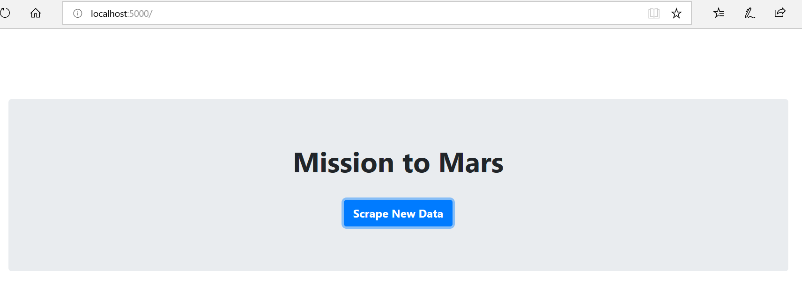
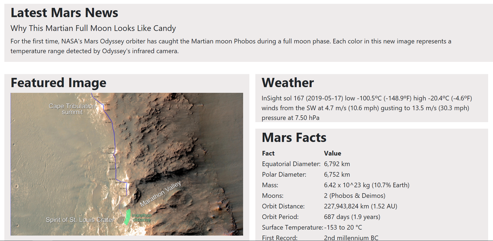
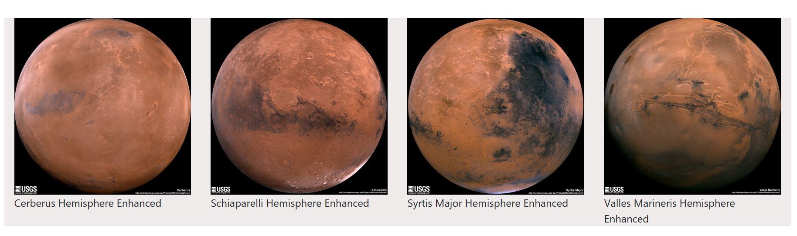
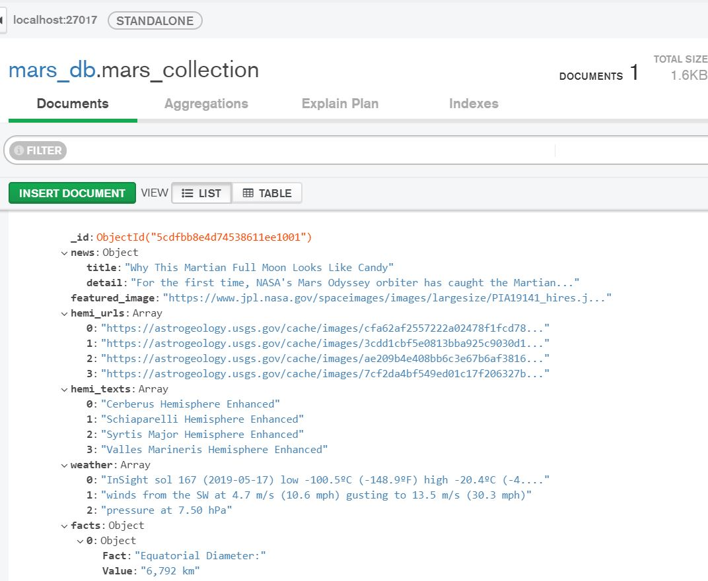

# Mission to Mars

### File Description:
mission_to_mars.ipynb - Jupyter notebook (Without Scrape function)
scrape_mars.py - Python file with Scrape function
chromedriver.exe - Chrome Driver ( Required)
app.py - Flask app

#### Developed the app in 2 pages 

##### templates/index.html - First/ landing page

##### templates/scrape.html - Second page with scraped data 

##### Mongo DB Screenshot

